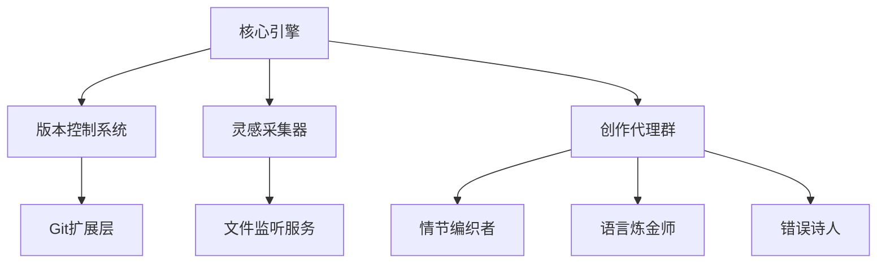

# The Poem of Erorrs

这是一个探索“文码互渗”的实验性项目，它的特殊之处在于，它既是一个代码库，也是一篇由代码和文字混合而成的“文学作品”。

## 计划和想法

1. 使用git来管理“文字库”（包含代码库和文字库）、写作进度和分支（分支可以是情节的、体裁的、语言版本的）。
2. 文字部分和代码部分都使用LLM的能力来规划、撰写、修改、润色、校核。
3. 通过编写专门的角色的代码和工具来定义多个协作的Agents来使用LLM。非常强调human-in-the-loop的,拟采用langgraph框架。
4. 创建MCP Server，读取特定的文件系统内的目录，来获取用户（我本人, 或项目的其他成员/贡献者）的写作灵感。
5. 创建和使用特定的工具，例如搜索 来做事实核查。
6. 暂时不需要前端界面，只需要产出文档。按章节产出，每章节为一份markdown文档。
7. 具有一个特定的模块（可以是一个agent）来把控各章节之间的连贯性──无论由新灵感激发的新章节内容有多么的天马行空。就像在代码世界里可以import依赖一样，探索某种方式将情节和文字“import”或以“依赖安装”的方式融合到当前的文档库/代码库里。
8. “语言对语言原则”：不同的自然语言（例如中文（包括方言、古文）、英文、意大利语和阿拉伯语）都可以表达同一种意思，正如不同的编程语言（例如python, typescript，java）可以实现同一种功能。自然语言的古老版本，对应编程语言的古老版本。流行的编程框架对应流行的写作模板。
9. “数学对思想原则”，代码的依赖编程语言、操作系统和计算机硬件，更底层是工程和数学；而文学创作依赖着构思、语法和思想。我们将大量使用多变的拓扑学和模糊数学的方式，来建模语义、语形、语法之间的映射，从而探索数学和思想之间的隐秘关联。
10. “报错的警告化”，程序世界报错不可容忍，但文字世界没有报错，在很多场合（例如诗歌体裁）以不一致性为追求，因此在这个项目里，除了上述提到的要实现的功能（MCP、Multi-Agents）之外，当项目开始运行时，它产出的“混合式文学作品”在任何时候都绝不追求可运行，我们要将报错或bug真正的视为一种feature，这还不同于程序员对待warning的方式（心情好就处理一下，通常无视warning），我们要重视和利用warning，将warning视为本项目最重要的文学灵感启示。但在任何时候都追求可阅读性。

## 初步的架构设计



## 核心类示例

```python
# error_poet.py 初始版本
class ErrorAlchemist:
    def __init__(self):
        self.metaphor_library = {
            'IndexError': '情节线索在虚空处断裂',
            'TypeError': '语言基因发生不可预知的突变',
            'KeyError': '角色在记忆迷宫中遗失身份密钥'
        }

    def transmute(self, error):
        return f"【{error.__class__.__name__}启示录】\n" + \
               f"{self.metaphor_library.get(error.__class__.__name__, '未知的叙事裂痕')}\n" + \
               f"原始轨迹：{str(error)}"
```